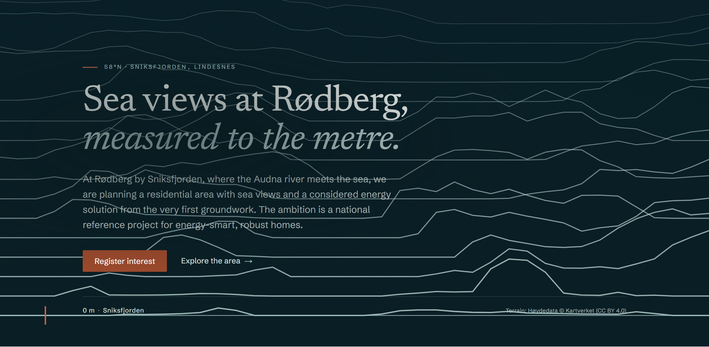

<div align="center">

<picture>
  <source media="(prefers-color-scheme: dark)" srcset="docs/assets/logo-dark.svg" />
  
</picture>

<p><em>Sjøutsikt i Rødberg</em></p>

<p><strong>A new coastal neighbourhood on Norway's south coast, and the digital home that tells its story.</strong></p>


<br/>



</div>

---

## What this is, in plain words

**Knotten** is a small seaside neighbourhood being planned at **Rødberg**, where the **Audna** river meets the sea by **Sniksfjorden** in **Lindesnes**, on Norway's south coast. It is being developed by **Sigve Simonsen AS** with an unusual ambition: to be one of Norway's most energy-efficient and resilient places to live, where the energy, the infrastructure and the homes are planned together from the very first day rather than bolted on afterwards.

This repository is the project's **public website and concept material**, the place where Knotten introduces itself to the people who matter: future neighbours, the municipality, and partners. In everyday terms, it lets a visitor:

- **See the place honestly.** The sea view, the Nordic light and the setting, described as they genuinely are, with no exaggerated sightlines and no stock sunsets.
- **Walk the real hillside in 3D.** The actual terrain at Rødberg, rebuilt from Norway's national elevation survey, so you can explore the land and how each plot looks toward the sea.
- **Understand the value, not just the promise.** Simple calculators turn the energy ambition into numbers anyone recognises: yearly energy use, monthly cost, and how shielded a home is from Norway's volatile electricity prices.
- **Register interest, with no obligation.** A calm, privacy-first sign-up for people who want to follow the project as it takes shape.
- **Read everything in their own language.** Full Norwegian and English, side by side.

Every figure on the site is marked as **indicative and sourced**, every illustration is labelled, and nothing about the location is fabricated. The project is still **before zoning and before sales launch**, so the platform's job today is honest credibility and interest, not transactional sales.

> **The idea in one line:** sea views at Rødberg, _measured to the metre_, shown from real survey data rather than a marketing brochure.

---

## Status

Early development. The project is pre-salgsstart and pre-regulering, so the platform's job is credible interest capture and stakeholder credibility, not transactional sales. The production deployment stays access-gated and `noindex` until review and go-live approval.

Unit count, plot sizes, prices, gnr/bnr, floor plans and site photography are not yet finalised by the developer. Everything is built data-driven against clearly marked placeholders; see `docs/INPUTS-NEEDED.md`.

## Stack

- **Web:** Next.js (App Router, TypeScript), hosted on Vercel
- **Data:** managed PostgreSQL in an EU region (parameterised access, migrations in repo)
- **i18n:** Norwegian (default) and English, full parity
- **Styling:** Tailwind with an owned component library and design tokens from the Knotten palette
- **Analytics:** Plausible (EU, cookieless)
- **Email:** EU/EEA-resident provider for lead notifications and double opt-in
- **Maps and terrain:** MapLibre + OpenStreetMap; Kartverket Høydedata for the 3D terrain showpiece

## Repository layout

```
docs/
  assets/       README and brand assets (logo and landing image)
  research/     verified Norwegian regulation, standards and data sources, with citations
  decisions/    architecture decision records
  specs/        feature specifications and per-spec completion notes
  security/     threat model and security review
  privacy/      processing record, retention, consent
  runbooks/     operational procedures
  INPUTS-NEEDED.md   client data still required
  OPEN-QUESTIONS.md  decisions awaiting the developer
COSTS.md        running monthly cost ledger
```

## Principles

- Quality and honesty first. Every public number is labelled, sourced and disclaimed; estimates are estimates, simulations are simulations, placeholders are marked.
- Privacy by design. Data minimisation, explicit consent, EU data residency, GDPR from day one.
- Security first. The lead database is treated as the crown jewel.
- Performance is a feature, enforced as a hard budget.
- Operable by a non-technical owner.
